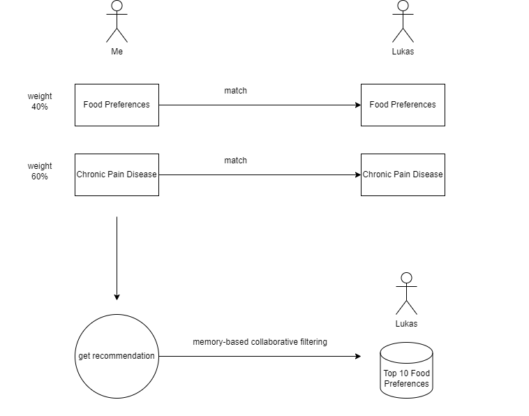
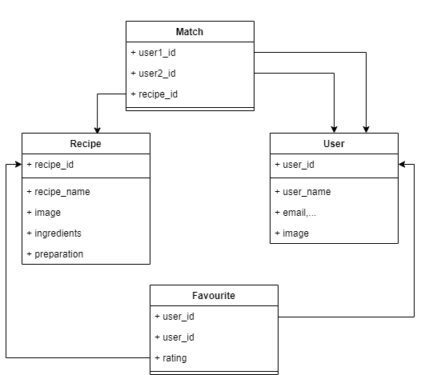

# Machine Learning-Recommendation System

### Implementation in our System
After the registration the user has to enter his top 10 recipes which
we give a 5-star ranking on.

**How does the matching with other users work?**  
We match on the specific disease and the area of pain as a 
second parameter. Open would also be considering the age too.

**How does the matching with recipes work?**  
We build an engine to get recommended recipes based on other user’s 
choices by using memory-based collaborative filtering.

User based collaborative filtering is a type of recommendation system algorithm that uses user similarity to make product recommendations.

For building the recommendation engine we need:
1)	One csv_file containing user_id, recipe_id, rating
2)	.csv_file containing recipes with columns recipe_id, name, ingredients

### How does our database look like?  
Here is an Entity-Relationship Diagram:

